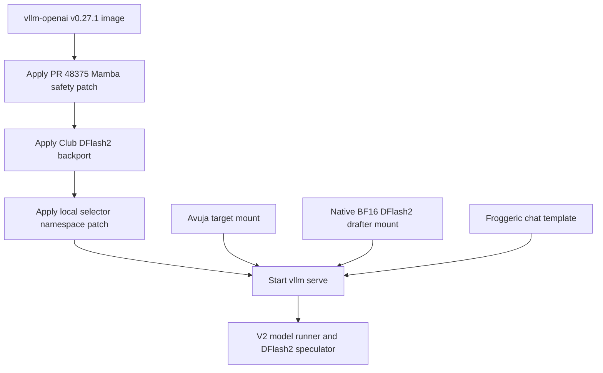

# Port architecture

## Design objective

The port had to add native DFlash2 support to a released vLLM image without modifying
the canonical Avuja stack or building a new image. Everything specific to the experiment
is mounted read-only and applied to the container's ephemeral installed package before
`vllm serve` starts.



The implementation is in [`../docker-compose.yml`](../docker-compose.yml). The canonical
Avuja Compose file is untouched, so rollback is `docker compose down` plus removal of the
experimental stack from service rotation.

## Runtime overlay sequence

The entrypoint performs these steps in order:

1. `bash /etc/club3090/pr48375/install.sh`
2. `bash /etc/club3090/dflash2/install.sh`
3. `python3 /etc/localllm/dflash2/patch_candidate_selector_namespace.py`
4. Validate that `DRAFT_SPEC_N` is a non-negative integer.
5. Add `--quantization` when configured.
6. If `DRAFT_SPEC_N > 0`, construct:

   ```json
   {"method":"dflash","model":"/models/drafter","num_speculative_tokens":7}
   ```

7. Execute `vllm serve` with the normal command arguments.

Both vendored installers are anchor checked. If the installed vLLM source no longer
matches the expected v0.27.1 layout, startup fails rather than silently serving an
unpatched or partly patched engine.

## Six required DFlash2 integration areas

The phrase “DFlash2 patch” hides several independent requirements. The vendored patch
modifies ten existing files and adds three new files; functionally they form six areas.

### 1. DFlash2 model architecture

`model_executor/models/qwen3_dflash2.py` adds `DFlash2DraftModel` support:

- grouped dynamic depthwise convolutions;
- candidate selector and its learned codebooks;
- target LM-head candidate projection;
- DFlash2-specific model/decoder classes.

The base DFlash model also gains subclass seams and explicit causality precedence. The
published checkpoint declares `is_causal=false`; ignoring that setting can silently run
the wrong draft mask and reduce acceptance without a hard error.

### 2. Model registry and V2 runner routing

`model_executor/models/registry.py` registers `DFlash2DraftModel`.
`config/vllm.py` detects the architecture and forces the V2 model runner. This matters
because the V1 DFlash proposer lacks the candidate selector; allowing the checkpoint to
reach V1 could silently degrade it to DFlash1 behavior.

### 3. DFlash2 speculator and path walk

`v1/worker/gpu/spec_decode/dflash2/` adds the V2 speculator and the Triton candidate
path walk. `v1/worker/gpu/spec_decode/__init__.py` chooses it when the speculative
method is `dflash` and the draft architecture is `DFlash2DraftModel`.

The method name remains `dflash`; the architecture selects the DFlash2 implementation.
Changing the method string is not how this native path is distinguished.

### 4. Slot allocation and DFlash input hardening

The backport carries newer-main fixes that v0.27.1 did not contain:

- reserve K draft slots per request rather than K−1;
- initialize sample-index padding with sentinel `-1` so CUDA-graph padding rows do not
  scatter into request slot zero;
- protect rejected-suffix and null-block rows from writing draft KV to physical block 0;
- clamp sequence lengths for DFlash prepare-input kernels.

These are not optional performance tweaks. They protect proposal state and memory
addressing, especially under batching and graph replay.

### 5. Sampling and lossless verification plumbing

The V2 model runner and sampler pass proposal logits and sampling state needed by the
selector. The backport accounts for v0.27.1's temperature-applied draft-logit behavior,
applies request top-k/top-p to the selector proposal, and includes NaN guards before
rejection-sampler argmax operations.

This area is why copying one model file is unsafe: DFlash2's selected path and proposal
probabilities must remain consistent with the target verifier's rejection-sampling
contract.

### 6. Quantization and top-k compatibility

The overlay permits the Avuja INC/AutoRound target's unquantized `ParallelLMHead` path
and can dispatch candidate projection through the target quantization method. It also
contains the FlashInfer/`torch.topk` compatibility controls and the V2 small-top-k
sampler plumbing inherited from the Club backport.

At runtime, the requested `auto_round` quantization resolved internally to `inc`, which
is expected for this checkpoint/image combination.

## Additional local patches

### Candidate-selector compile namespace

[`../local-patches/patch_candidate_selector_namespace.py`](../local-patches/patch_candidate_selector_namespace.py)
adds:

```python
with set_model_tag("dflash2_candidate_selector"):
    self.candidate_selector = CandidateSelector(...)
```

This keeps the selector's compiled graph separate from `dflash_head`. The script is
idempotent and anchor checked; it prints:

```text
[dflash2-local] candidate-selector compile namespace applied
```

### Mamba `drop_eagle_block`

The vendored PR #48375 patch lowers the Mamba hit-search ceiling when EAGLE-style
speculation requires the final matched unit to be recomputed. It prevents restoration of
recurrent state that may include later-rejected draft positions.

This patch contributed to the measured zero-hit behavior when no earlier resumable
Mamba boundary existed. That is a safe failure mode. It must not be removed merely to
increase hit counters; see [the root-cause document](04-prefix-cache-root-cause.md).

## Mounts and persistence

| Mount | Container path | Mode/purpose |
|---|---|---|
| Avuja target | `/models/model` | Read-only served target |
| Native drafter | `/models/drafter` | Read-only DFlash2 checkpoint |
| Froggeric template | `/etc/qwen-custom-chat-template.jinja` | Read-only tool/chat formatting |
| DFlash2 backport | `/etc/club3090/dflash2` | Read-only runtime patch |
| PR #48375 | `/etc/club3090/pr48375` | Read-only runtime patch |
| Local patches | `/etc/localllm/dflash2` | Read-only compile namespace patch |
| vLLM compile cache | `/root/.cache/vllm/torch_compile_cache` | Persistent host cache |
| Triton cache | `/root/.triton/cache` | Persistent host cache |

The installed Python package is modified only in the running container layer. Recreating
the container reapplies the exact checked-in overlays.

## P11 profile

[`../profiles/avuja-11-dflash2-fp8-kv.env`](../profiles/avuja-11-dflash2-fp8-kv.env)
was the first and only benchmarked DFlash2 profile.

| Setting | Value | Reason |
|---|---:|---|
| Image | `vllm/vllm-openai:v0.27.1` | Stable project baseline plus overlay |
| TP / GPUs | 2 / `0,1` | Dual PCIe RTX 3090 |
| Target dtype | BF16 compute | Checkpoint/runtime compatibility |
| Target quantization | `auto_round` → runtime `inc` | Avuja W4A16 checkpoint |
| DFlash2 draft tokens | 7 | Checkpoint block size 8 implies 7 proposals |
| Max model length | 131,072 | Capacity compromise for heavy BF16 drafter |
| Max sequences | 2 | Explicit two-agent lane |
| Batched tokens | 8,192 | Existing Avuja baseline; produced an 8,178 scheduling warning under speculation |
| GPU memory utilization | 0.80 | Required headroom for drafter and graph warmup |
| KV dtype | FP8 E4M3 | Preserve more context than BF16 KV |
| Prefix caching | Enabled | Required for agent follow-up efficiency |
| Mamba cache mode | `align` | Supported hybrid-cache mode |
| Chunked prefill | Enabled | Large-context prefill behavior |
| Async scheduling | Disabled | First correctness soak; avoid another moving variable |
| Custom all-reduce | Disabled | Existing topology-safe profile choice |
| Tool parser | `qwen3_coder` | Avuja tool path |
| Reasoning parser | `qwen3` | Avuja reasoning path |
| Thinking | Disabled, effort low | Aligned tuning series |
| Sampling | T 0.7, top-p 0.80, top-k 20, presence 1.5 | Existing Avuja settings |

The matched control changes only `DRAFT_SPEC_N=0`; target, image, template, KV dtype,
context, cache mode, scheduler, memory utilization, and sampling remain aligned.

## Observed runtime resolution

The completed runs established:

- image digest
  `vllm/vllm-openai@sha256:0a51ea5b4ae2dc5d81890e5173f54203d2a3ae0cfffe51b8fd2afd4391bfd967`;
- V2 model runner selected;
- native BF16 drafter loaded;
- `method='dflash'`, n=7;
- FlashInfer attention path;
- CUDA graph mode downgraded to `PIECEWISE`;
- distinct `dflash_head` and `dflash2_candidate_selector` compile namespaces;
- nonzero acceptance metrics;
- logical KV pool of 221,379 tokens;
- no restart, OOM, CUDA index fault, or observed long-run acceptance collapse across
  two full benchmark runs.

The overlay's `VLLM_DFLASH2_*` variables may appear as unknown-vLLM-environment warnings
because the overlay reads them directly rather than through stock vLLM's environment
registry. In this port those warnings do not mean the variables were ignored.

## Why no custom image was built

A runtime overlay was appropriate for a short-lived experiment because it was:

- reversible;
- pinned and inspectable in the repository;
- fast to iterate;
- able to refuse boot on source drift;
- isolated from canonical stacks.

If this path becomes production-worthy, a reproducible custom image should replace the
startup mutation. The image should pin upstream commits, execute patch/tests at build
time, record its digest, and remove the need to modify site-packages on every boot.
